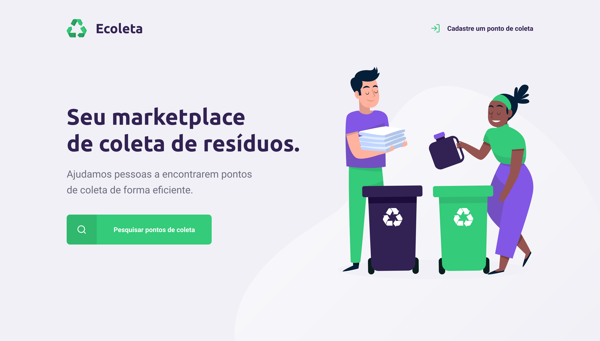

<h1 align="center"> ECOLETA </h1>

Project developed through the event promoted by Rocketseat for teaching WEB technologies.

  <a href="#-tecnologias">Technologies</a>&nbsp;&nbsp;&nbsp;|&nbsp;&nbsp;&nbsp;
  <a href="#-projeto">Project</a>&nbsp;&nbsp;&nbsp;|&nbsp;&nbsp;&nbsp;
  <a href="#-layout">Layout</a>&nbsp;&nbsp;&nbsp;|&nbsp;&nbsp;&nbsp;
  <a href="#memo-licença">License</a>

  

 

  

## 🚀 Technologies

This project was developed with the following technologies:

- HTML
- CSS
- JavaScript
- Node.js
- Express
- SQLite
- Nunjucks
- Git
- GitHub 

## 💻 Project

Ecoleta is a marketplace that helps people find recycle collection points efficiently.

## 🔖 Layout

You can view the layout of the project through [LINK](https://www.figma.com/file/Byw4X5etg8VCmezueyhzkC/Ecoleta-(Starter)?node-id=136%3A548&t=5gan5LnHSy0sVbvJ-0). You need an account on [Figma](https://figma.com) to access it.

---

## License

This project is under the MIT license.

